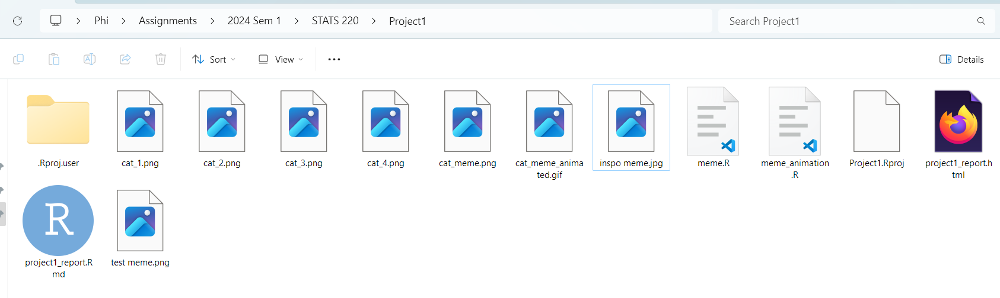
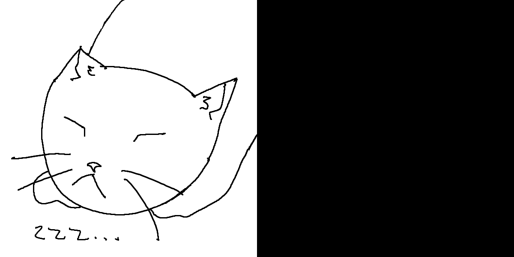

```{r setup, include=FALSE}
knitr::opts_chunk$set(echo = TRUE, message = FALSE, warning = FALSE, error = FALSE)
```

(Apologies for the ugly CSS code right at the top.)

```{css, class.source = "code"}
@import url('https://fonts.googleapis.com/css2?family=Noto+Sans+Mono:wght@100..900&display=swap');
@import url('https://fonts.googleapis.com/css2?family=Lora:ital,wght@0,400..700;1,400..700&family=Noto+Sans+Mono:wght@100..900&display=swap');

body {
  background-color: #FFDDDD;
  padding-left: 25%;
  padding-right: 25%;
  padding-top: 10%;
  padding-bottom: 10%;
  text-align: center;
}

h1, h2, h3, h4 {
  font-family: "Lora", serif;
  font-weight: 600;
  color: #773333;
}

p {
  font-family: "Noto Sans Mono", monospace;
  text-align: center;
  color: #330000;
}

img {
  border: inset;
  border-color: #DDBBBB;
  display: block;
  margin: auto;
}

.code {
  text-align: left;
  background-color: #F4E9E9;
}
```

## Project requirements

To meet the requirements related to working with GitHub, I've created a repository for this class (including this course) at [https://github.com/phi-zhang/stats220/tree/main](https://github.com/phi-zhang/stats220/tree/main). In it, I've created a README.md file with two different levels of headers, two different types of bullet points, use of bold and italics, and a link to another website. I've also included an index page for the GitHub Pages site, and a folder with files for this project.

The GitHub Pages site for this project is a bit bare-bones right now, but you can see this report on the web at [https://phi-zhang.github.io/stats_220/project1/project1_report](https://phi-zhang.github.io/stats_220/project1/project1_report).

And finally, here is a screenshot of the project folder on my computer: 

## My meme

The inspo meme was the "galaxy brain meme". Here is the original meme, according to knowyourmeme.com:


The key components of the meme are the images, the text, and the progression. The images depict a transparent human head with the brain visible. The text is something with the potential to become a funnier version of itself (in this case, the word "who"). The progression of the images shows the brain growing larger and brighter, suggesting that the text next to corresponding image is the more "enlightened" or funnier version of the text next to the image before.

For my meme, I mostly retained the sense of progression of something mundane into something "enlightened", and I changed the text, the images, and the order of text and images. I drew my own illustrations for the meme, and since I thought they would be more interesting to look at than the text, I put them on the left of the text. I changed the text to variations on the onomatopoeia "meow" corresponding to the emotion displayed in the image.

The code used to create my meme is below.

```{r meme-code, eval=TRUE, class.source = "code"}
library(magick)

# Define a function to make the panels for one row of the meme

make_row_vector <- function(image, text, dimension = 600, border = "brown") {
  image_panel <- image %>%
    image_extent(paste(dimension, "x", dimension)) %>%
    image_border(
      color = border,
      geometry = paste(dimension / 100, "x", dimension / 100)
    )
  text_panel <- image_blank(
    width = dimension,
    height = dimension,
    color = "black"
  ) %>%
    image_annotate(text,
      color = "white",
      font = "Impact", size = dimension / 10,
      gravity = "center", style = "Oblique"
    ) %>%
    image_border(
      color = border,
      geometry = paste(dimension / 100, "x", dimension / 100)
    )
  return(c(image_panel, text_panel))
}

# Define a function to make the full meme

make_meme <- function(image_vector, text_vector) {
  rows_vector <- image_vector
  for (i in 1:length(image_vector)) {
    rows_vector[i] <- image_append(
      make_row_vector(image_vector[i], text_vector[i])
    )
  }
  return(rows_vector %>% image_append(stack = TRUE))
}

# Use the functions to make the meme, and then write the meme

image_vector <- c(
  image_read("cat_1.png"), image_read("cat_2.png"),
  image_read("cat_3.png"), image_read("cat_4.png")
)
text_vector <- c("Meow...", "Meow?", "Meow!", "Meowwwww~!")
meme <- make_meme(image_vector, text_vector)
image_write(meme, "cat_meme.png")

# Display the meme for the web

meme
```

Furthermore, here is the code I have used to animate my meme, as well as a GIF showing the animation. 

```{r animation-code, eval=FALSE, class.source = "code"}
library(magick)

# Define a function to make the frames needed to animate one row

create_animation_frames <- function(image, text, dimension = 600) {
  cat_frames <- rep(image, times = 20)
  for (i in 5:9) {
    cat_frames[i] <- image_rotate(image, 72 * i - 4) %>%
      image_extent(paste(dimension, "x", dimension))
  }

  blank_image <- image_blank(
    width = dimension,
    height = dimension,
    color = "black"
  )
  text_image <- blank_image %>%
    image_annotate(text,
      color = "white",
      font = "Impact", size = dimension / 10,
      gravity = "center", style = "Oblique"
    )
  text_frames <- c(rep(blank_image, times = 10), rep(text_image, times = 10))

  all_frames <- cat_frames
  for (i in 1:20) {
    all_frames[i] <- image_append(c(cat_frames[i], text_frames[i]))
  }
  return(all_frames)
}

# Define a function to animate each row, one after the other

animate_meme <- function(image_vector, text_vector) {
  all_rows_frames <- rep(rep(image_vector[1], times = 20),
    times = length(image_vector)
  )
  for (i in 1:length(image_vector)) {
    row_frames <- create_animation_frames(image_vector[i], text_vector[i])
    end_index <- i * length(all_rows_frames) / length(image_vector)
    all_rows_frames[(end_index - 19):end_index] <- row_frames
  }

  meme_animation <- image_animate(all_rows_frames, fps = 10)
  return(meme_animation)
}

# Use the functions to animate the meme and save it as a GIF

rows <- 4
image_vector <- c(
  image_read("cat_1.png"), image_read("cat_2.png"),
  image_read("cat_3.png"), image_read("cat_4.png")
)
text_vector <- c("Meow...", "Meow?", "Meow!", "Meowwwww~!")
animated_meme <- animate_meme(image_vector, text_vector)
image_write(animated_meme, "cat_meme_animated.gif")
```



## Creativity

To meet the creativity requirements for this project, I've used the untaught `image_border()` and `image_rotate()` functions in my meme's creation and animation respectively. I've also changed more than the necessary CSS: I've changed the background colour (for the page and for the code blocks), the text colours, the padding, the fonts, the alignments, and the image border. I also drew my own illustrations for the meme, if that counts!

## Learning reflection

An important idea I learned from Module 1: Creating HTML by modern technologies has been how different data technologies can be combined to form our digital creations. I've used many of these technologies in isolation before: Markdown for my notes; HTML/CSS for website projects in high school; R for data analysis in other STATS classes. But it's been fascinating to see how using them together can produce standalone "finished" products which are ready for an audience.

In terms of other data technologies I'd like to explore, putting my CSS into a stylesheet would be great. I plan to have a similar style for my whole site anyways. I'd perhaps also be interested in learning then using some Javascript to make my page interactive. I tried to write my functions so that they should be able to be modified to accept different images and text, so I could make a web app out of that, if a way to write interactive client-side R exists (I believe I've heard of something called Shiny). Also, I'd love to try using some of the image manipulation and animation I've learned in this module with the ggplot2 package to make animated graphs.
